<div align="center">
  
  
  # MCP Portal 🚀
  
  **The Ultimate Model Context Protocol Hub**
  
  Aggregate tools from multiple MCP servers into a unified portal with dynamic discovery and cross-platform Docker support.
</div>

[](https://python.org)
[](https://docker.com)
[](LICENSE)

---

## 🏁 Quick Setup (Recommended: Docker)

### 🚀 Docker (Recommended)
1. **Build the Docker image:**
   ```bash
   docker build -t mcp-portal -f docker/Dockerfile .
   ```
2. **Run the container:**
   ```bash
   docker run -d -p 8020:8020 --name mcp-portal mcp-portal
  
   OR

   ### For Auto-Detect MCP Config
   python run-docker.py
   ```
3. **Open the Web UI:**
   - Visit [http://localhost:8020](http://localhost:8020) in your browser.

### 🐍 Python (Alternative)
1. **Install dependencies:**
   ```bash
   pip install -r requirements.txt
   ```
2. **Start the portal:**
   ```bash
   python -m mcp_gateway.main
   ```
3. **Open the Web UI:**
   - Visit [http://localhost:8020](http://localhost:8020) in your browser.

---

## ✨ Features

- **🔍 Dynamic MCP Discovery**: Automatically finds and integrates MCP servers from Cursor, VS Code, Claude Desktop, and more
- **🌐 Unified API**: Single endpoint for all your MCP tools and resources
- **🐳 Docker Ready**: Cross-platform containerization with automatic configuration mounting
- **⚡ Real-time Management**: Web UI for server management, tool exploration, and configuration editing
- **🔧 Cross-Platform**: Works on Windows, macOS, and Linux with intelligent command translation
- **📊 Monitoring**: Built-in logging, health checks, and performance metrics

## 🚀 Quick Start

### Local Development
```bash
# Clone and install
git clone https://github.com/Chillbruhhh/MCPPortal.git
cd mcp-portal
pip install -r requirements.txt

# Start the portal
python -m mcp_gateway.main

# Open web UI: http://localhost:8020
```

### Docker Deployment
```bash
# Build image
docker build -t mcp-portal -f docker/Dockerfile .

# Auto-detect and run with your MCPs
python run-docker.py
```

## 🎯 How It Works

MCP Portal automatically discovers MCP servers from your IDE configurations and aggregates them into a single, unified interface:

```mermaid
flowchart TB
 subgraph subGraph0["🔍 Discovery Phase"]
        D["Configuration Scanner"]
        A["Cursor IDE<br>Configuration"]
        B["VS Code<br>Settings"]
        C["Claude Desktop<br>Config"]
        E["Other IDEs<br>Config Files"]
  end
 subgraph subGraph1["🚀 MCP Portal Core"]
        F["Server Discovery Engine"]
        G["Configuration Parser"]
        H["Server Registry"]
        I["Process Manager"]
        J["Tool Aggregator"]
        K["Unified API Server"]
  end
 subgraph subGraph2["📡 MCP Servers"]
    direction LR
        S1["Search Engine<br>MCP Server"]
        S2["Database Tools<br>MCP Server"]
        S3["Browser Control<br>MCP Server"]
        S4["File System<br>MCP Server"]
        S5["Web Scraping<br>MCP Server"]
        S6["Code Analysis<br>MCP Server"]
  end
 subgraph subGraph3["🛠️ Aggregated Tools"]
    direction LR
        T1["web_search"]
        T2["database_query"]
        T3["take_screenshot"]
        T4["read_file"]
        T5["scrape_website"]
        T6["analyze_code"]
  end
 subgraph subGraph4["🎛️ Management Dashboard"]
        N["Web UI Dashboard<br>Monitor &amp; Control MCP Servers"]
        N1["Server Status Monitor"]
        N2["Tool Management"]
        N3["Configuration Editor"]
        N4["Real-time Logs"]
  end
 subgraph subGraph5["🌐 AI Agent Interface"]
        L["REST API<br>Tool Endpoints"]
        M["WebSocket/SSE<br>Real-time Events"]
  end
 subgraph subGraph6["🤖 AI Agents & Applications"]
        O["Claude Desktop<br>AI Assistant"]
        P["ChatGPT<br>AI Assistant"]
        Q["Custom AI Apps<br>Autonomous Agents"]
        R["Development Tools<br>AI-Powered IDEs"]
        S["Multi-Agent Systems<br>Agent Frameworks"]
  end
 subgraph subGraph7["🔄 Workflow"]
    direction TB
        W2["Parse MCP Settings"]
        W1["Scan IDE Configs"]
        W3["Start MCP Servers"]
        W4["Aggregate Tools"]
        W5["Expose Unified API"]
        W6["AI Agents Call Tools"]
        W7["Return Results"]
  end
    A --> D
    B --> D
    C --> D
    E --> D
    D --> F
    F --> G
    G --> H
    H --> I
    I --> J
    J --> K & T1 & T2 & T3 & T4 & T5 & T6
    K --> N & L & M
    N --> N1 & N2 & N3 & N4
    L --> O & P & R & S
    M --> Q
    I -.-> S1 & S2 & S3 & S4 & S5 & S6
    W1 --> W2
    W2 --> W3
    W3 --> W4
    W4 --> W5
    W5 --> W6
    W6 --> W7
     D:::discoveryStyle
     A:::discoveryStyle
     B:::discoveryStyle
     C:::discoveryStyle
     E:::discoveryStyle
     F:::portalStyle
     G:::portalStyle
     H:::portalStyle
     I:::portalStyle
     J:::portalStyle
     K:::portalStyle
     S1:::serverStyle
     S2:::serverStyle
     S3:::serverStyle
     S4:::serverStyle
     S5:::serverStyle
     S6:::serverStyle
     T1:::toolStyle
     T2:::toolStyle
     T3:::toolStyle
     T4:::toolStyle
     T5:::toolStyle
     T6:::toolStyle
     N:::dashboardStyle
     N1:::dashboardStyle
     N2:::dashboardStyle
     N3:::dashboardStyle
     N4:::dashboardStyle
     L:::interfaceStyle
     M:::interfaceStyle
     O:::aiStyle
     P:::aiStyle
     Q:::aiStyle
     R:::aiStyle
     S:::aiStyle
     W2:::workflowStyle
     W1:::workflowStyle
     W3:::workflowStyle
     W4:::workflowStyle
     W5:::workflowStyle
     W6:::workflowStyle
     W7:::workflowStyle
    classDef discoveryStyle fill:#e3f2fd,stroke:#1976d2,stroke-width:2px,color:#000
    classDef portalStyle fill:#f3e5f5,stroke:#7b1fa2,stroke-width:3px,color:#000
    classDef serverStyle fill:#e8f5e8,stroke:#388e3c,stroke-width:2px,color:#000
    classDef toolStyle fill:#fff3e0,stroke:#f57c00,stroke-width:2px,color:#000
    classDef dashboardStyle fill:#fff8e1,stroke:#ff8f00,stroke-width:2px,color:#000
    classDef interfaceStyle fill:#fce4ec,stroke:#c2185b,stroke-width:2px,color:#000
    classDef aiStyle fill:#e1f5fe,stroke:#0288d1,stroke-width:3px,color:#000
    classDef workflowStyle fill:#f1f8e9,stroke:#689f38,stroke-width:2px,color:#000
```



## 🛠️ Supported IDEs & MCP Sources

- **Cursor IDE** (`.cursor/mcp.json`)
- **VS Code** (`settings.json`)
- **Claude Desktop** (`claude_desktop_config.json`)
- **Windsurf** (`.windsurf/mcp_servers.json`)
- **Continue.dev** (`.continue/config.json`)
- **Custom configurations**

## 📋 API Endpoints

| Endpoint | Method | Description |
|----------|---------|-------------|
| `/` | GET | Web UI dashboard |
| `/api/v1/servers` | GET | List all MCP servers |
| `/api/v1/tools` | GET | List all aggregated tools |
| `/api/v1/resources` | GET | List all resources |
| `/api/v1/config` | GET/POST | Manage MCP configurations |
| `/api/v1/servers/refresh` | POST | Refresh server discovery |
| `/api/v1/mcp`        | SSE/POST | Main MCP endpoint for tool execution/events |
| `/sse` | GET | Server-Sent Events for real-time updates |

## 🔧 Configuration

### Environment Variables
```bash
MCP_PORTAL_PORT=8020
MCP_PORTAL_HOST=0.0.0.0
MCP_PORTAL_LOG_LEVEL=INFO
```

### Manual Configuration
```json
{
  "mcpServers": {
    "mcp-portal": {
      "type": "sse",
      "url": "http://localhost:8020/api/v1/mcp"
    }
  }
}
```

> **Note for Windsurf users**: Use `serverUrl` instead of `url` in your configuration:
 ```json
 {
   "mcpServers": {
     "mcp-portal": {
       "transport": "sse",
       "serverUrl": "http://localhost:8020/api/v1/mcp"
     }
   }
 }
 ```

### Claude Code
```python
claude mcp add-json mcp-portal '{"type":"sse","url":"http://localhost:8020/api/v1/mcp"}' --scope user
```

## 🐳 Docker Production Deployment

### Using Docker Compose
```docker
# 1. Build the Docker image
docker build -t mcp-portal .

# 2. Run the container
docker run -d -p 8020:8020 --name mcp-portal mcp-portal

# 3. Open the web UI
# Visit http://localhost:8020 in your browser
```

### Production Scripts
```bash
# Build and run production container
./docker/build.sh prod

# View logs
docker logs mcp-portal-container

# Stop
docker stop mcp-portal-container
```

## 📖 Usage Examples

### List Available Tools
```bash
curl http://localhost:8020/api/v1/tools
```

### Execute a Tool
```bash
curl -X POST http://localhost:8020/api/v1/tools/execute \
  -H "Content-Type: application/json" \
  -d '{"tool": "brave-search", "arguments": {"query": "MCP documentation"}}'
```

### Web UI Features
- **Server Management**: Enable/disable MCP servers
- **Tool Explorer**: Browse and test tools interactively
- **Configuration Editor**: Edit MCP configs with JSON validation
- **Real-time Monitoring**: Live server status and logs

## 🧪 Testing

```bash
# Run tests
pytest tests/

# Run with coverage
pytest --cov=mcp_gateway tests/

# Test specific functionality
pytest tests/test_discovery.py -v
```

## 🤝 Contributing

We welcome contributions! Please see our [Contributing Guide](CONTRIBUTING.md) for details.

1. Fork the repository
2. Create a feature branch (`git checkout -b feature/amazing-feature`)
3. Commit your changes (`git commit -m 'Add amazing feature'`)
4. Push to the branch (`git push origin feature/amazing-feature`)
5. Open a Pull Request

## 📝 License

This project is licensed under the MIT License - see the [LICENSE](LICENSE) file for details.


## 🎉 Acknowledgments

- [Model Context Protocol](https://github.com/modelcontextprotocol/protocol) for the foundational framework
- [FastAPI](https://fastapi.tiangolo.com/) for the excellent web framework
- [Pydantic](https://docs.pydantic.dev/) for data validation
- All the amazing MCP server developers in the community

---

**Ready to unlock the full potential of your MCP ecosystem?** ⭐ Star this repo and get started with `python run-docker.py`!